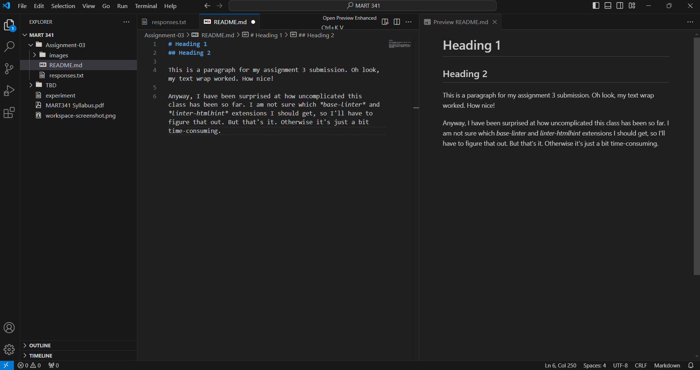

# Heading 1
## Heading 2

This is a paragraph for my assignment 3 submission. Oh look, my text wrap worked. How nice! 

Anyway, I have been surprised at how uncomplicated this class has been so far. I am not sure which *base-linter* and *linter-htmlhint* extensions I should get, so I'll have to figure that out. But that's it. Otherwise it's just a bit time-consuming.

[Responses](./responses.txt)
